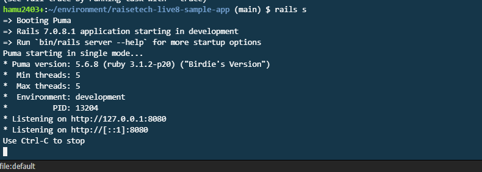
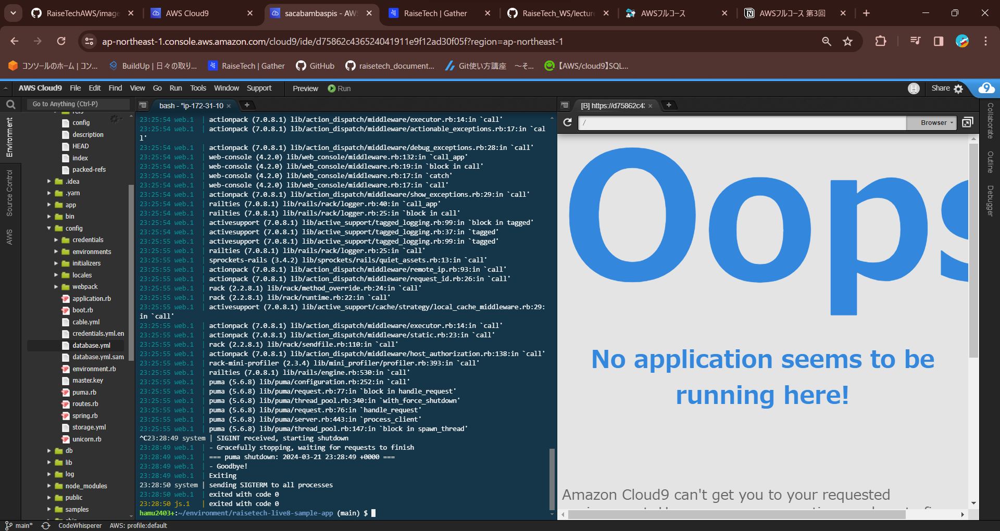
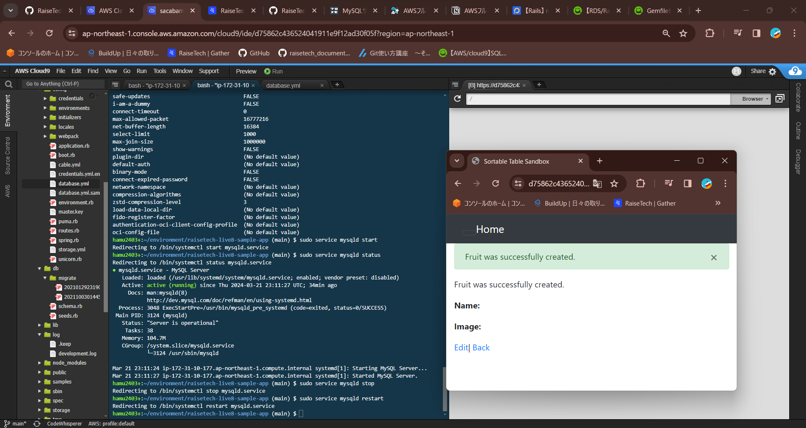
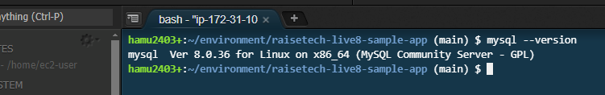
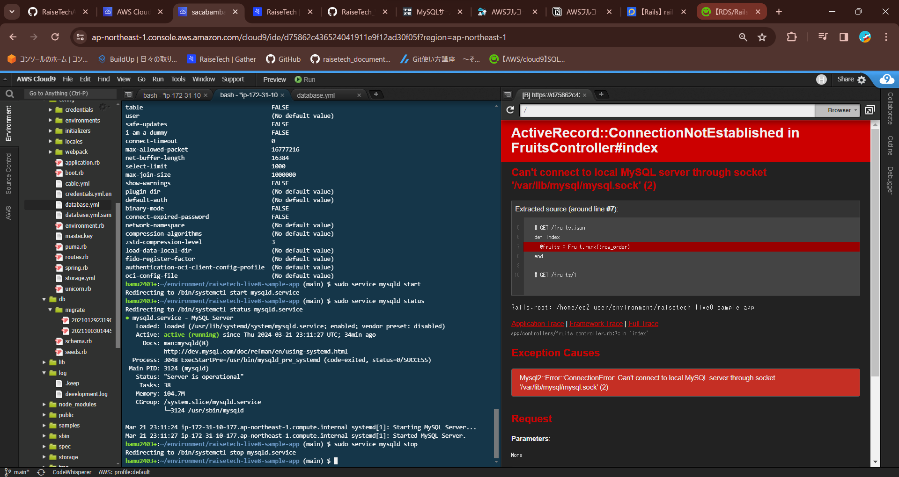
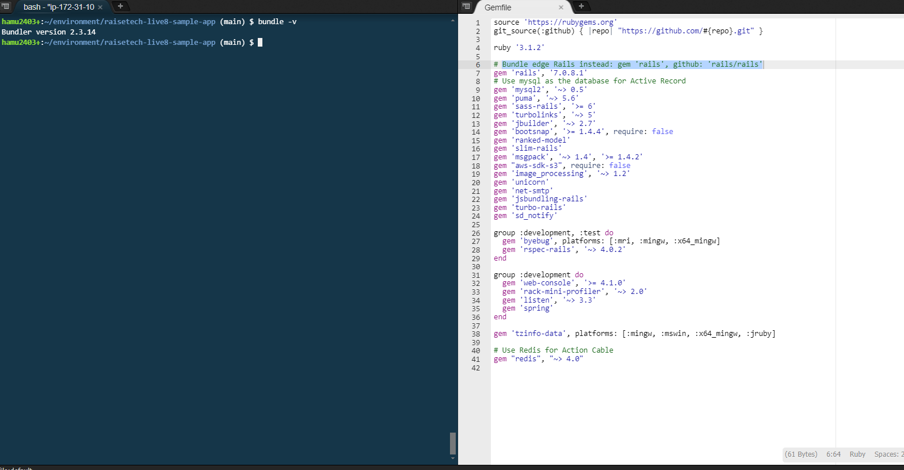

# 第3回課題

---
## 1. AP サーバーについて
---

* APサーバーの名前：**Puma**
* Puma version: **5.6.8**

* Puma起動時

* APサーバー終了時→ **アクセス不可**

-　再起動させるとアクセス可能になりました

---
## 2. DB サーバーについて
---

* DBサーバーの名前: **MySQL**

* DBサーバーのVersion: **8.0.36**

* DBサーバー終了後→ **アクセス不可**

* Railsの構成管理ツール→ **Bundler**

