# 第4回課題

## VPC・サブネットの構築

* VPC作成

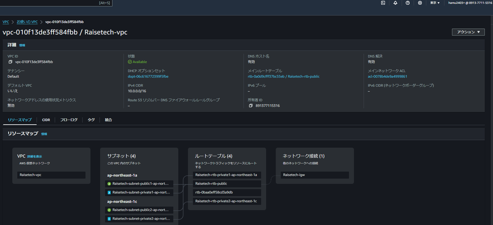

* サブネット **private1**

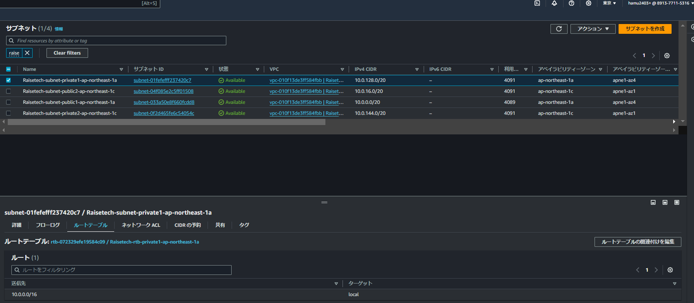

* サブネット **private2**

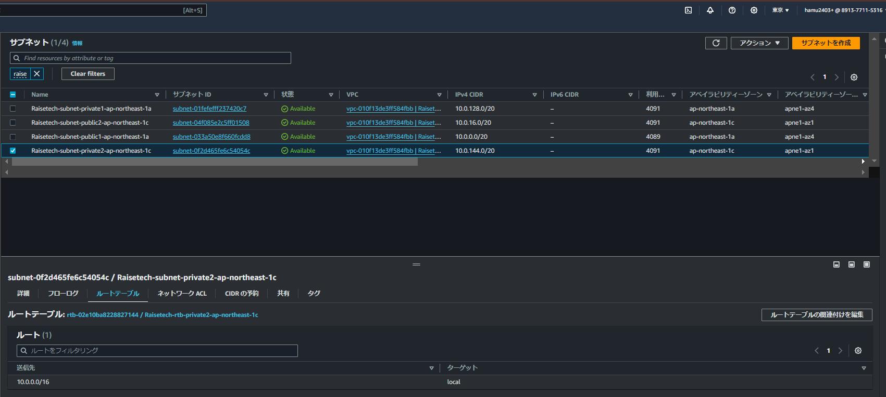

* サブネット **public1**

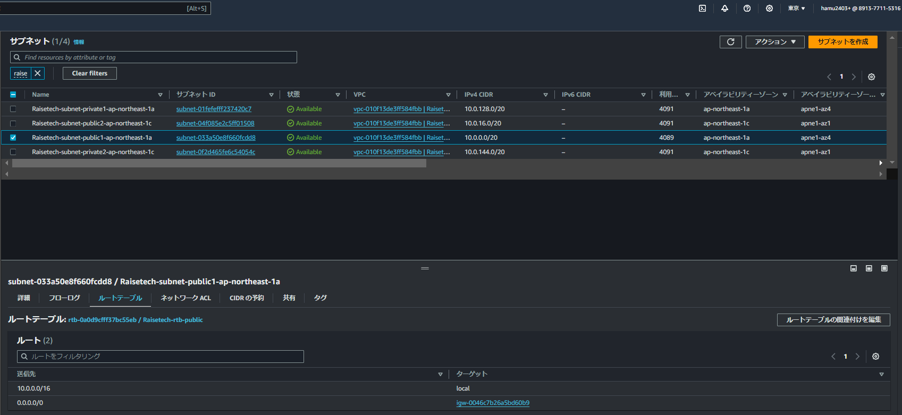

* サブネット **public2**

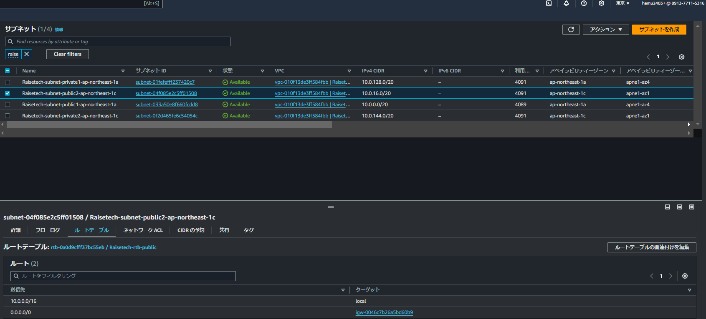

## EC2インスタンスの作成

## EC2のセキュリティグループ

* インバウンド (修正済み)

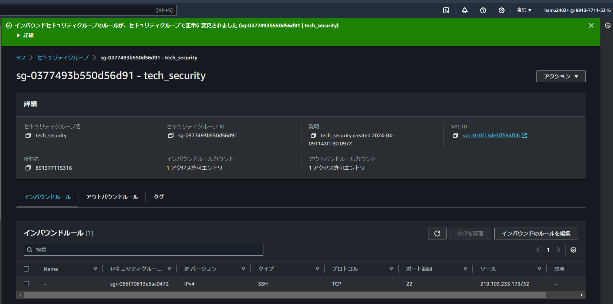　

* アウトバウンド

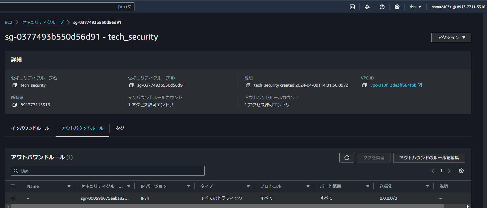

## RDSの作成　(要修正)

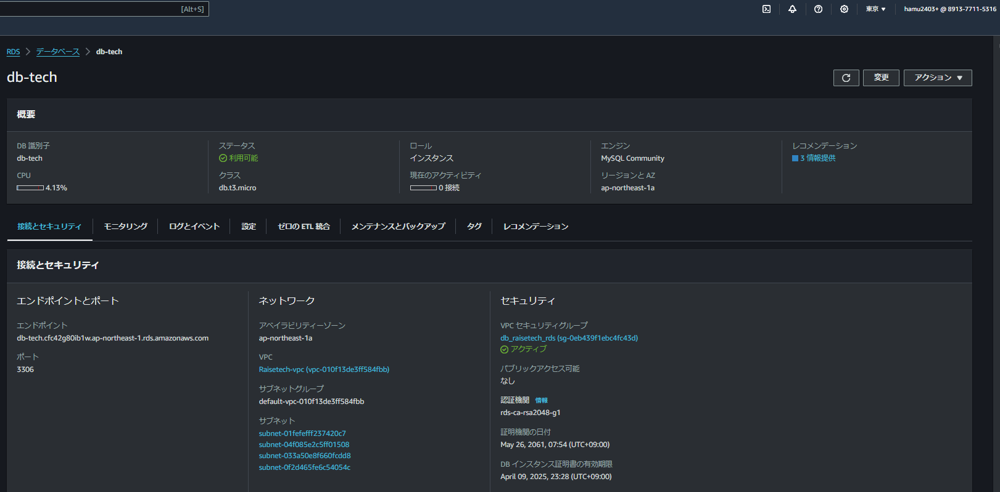

## RDSのセキュリティグループ

* インバウンド (要修正)

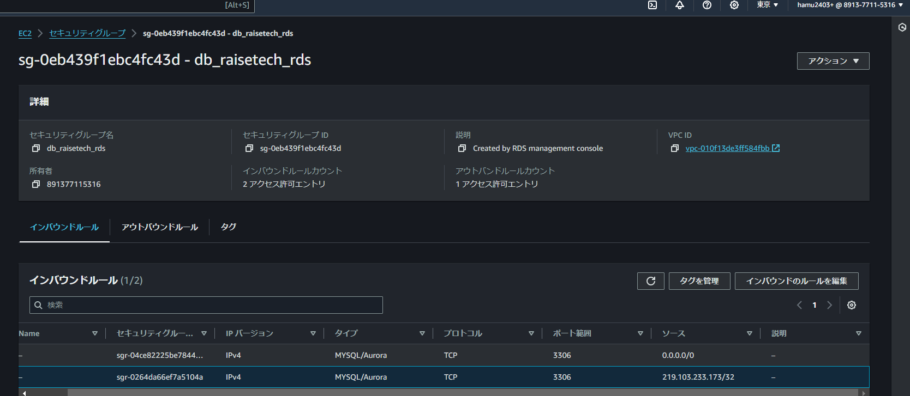

* アウトバウンド

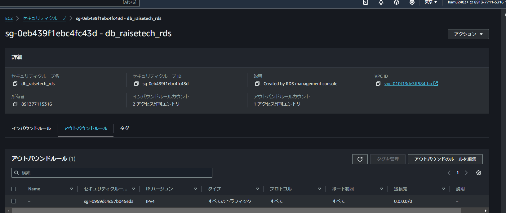

## Teratermを用いたEC2へのSSH接続及びECからRDSへ接続

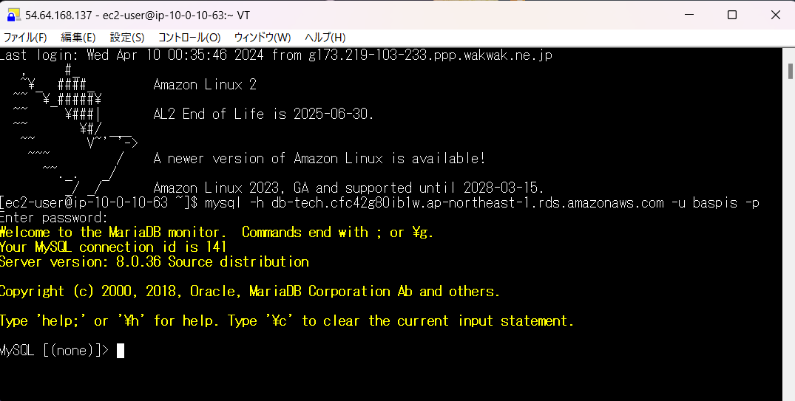

## 感想

* 秘密鍵の取り扱いには気を付けること、絶対に外部に流出刺せないことを心がける。
* また費用をできるだけ抑えるために、サインアウトの際は必ずEC2を停止する。
* 回を重ねるたびに知らない用語が増えていくので身につくように、また説明できるように勉強します。