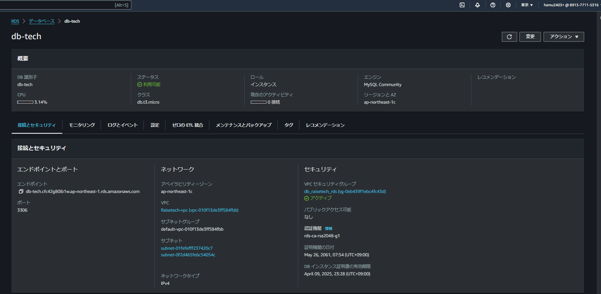
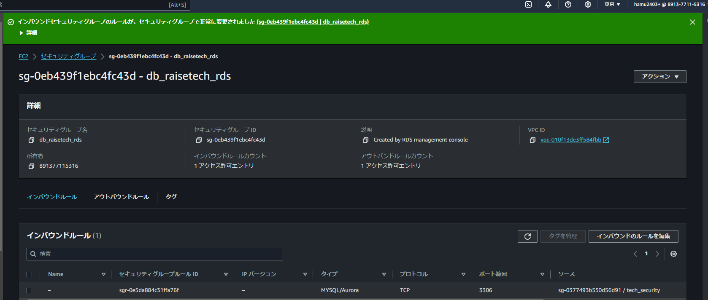
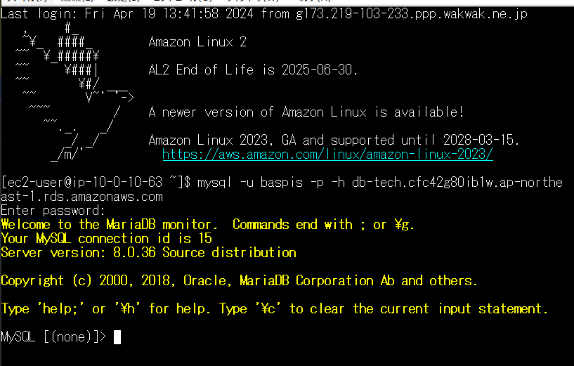

# 第4回課題

## VPC・サブネットの構築

* VPC作成

* サブネット **private1**

* サブネット **private2**

* サブネット **public1**

* サブネット **public2**

## EC2インスタンスの作成

## EC2のセキュリティグループ

* インバウンド (修正済み)

　

* アウトバウンド

## RDSの作成 (修正済み)

## RDSのセキュリティグループ

* インバウンド (修正済み)

* アウトバウンド

## Teratermを用いたEC2へのSSH接続及びECからRDSへ接続 (再接続済み)

## 感想

* RDSがパブリックサブネットに存在すると、DBグループから削除できないということに気づけず、プライベートサブネットのみのグループを作るのにかなり苦戦した。
* EC2とRDSのセキュリティグループが異なる場合、接続ができないことを知らなかった。
* 秘密鍵の取り扱いには気を付けること、絶対に外部に流出刺せないことを心がける。
* またDBインスタンスを数日動かしっぱなしにしていて、請求が思っていたよりも多くきてしまったので、 費用をできるだけ抑えるために、サインアウトの際は必ずEC2とDBインスタンスを停止する。
* 回を重ねるたびに知らない用語が増えていくので身につくように、また説明できるように勉強します。