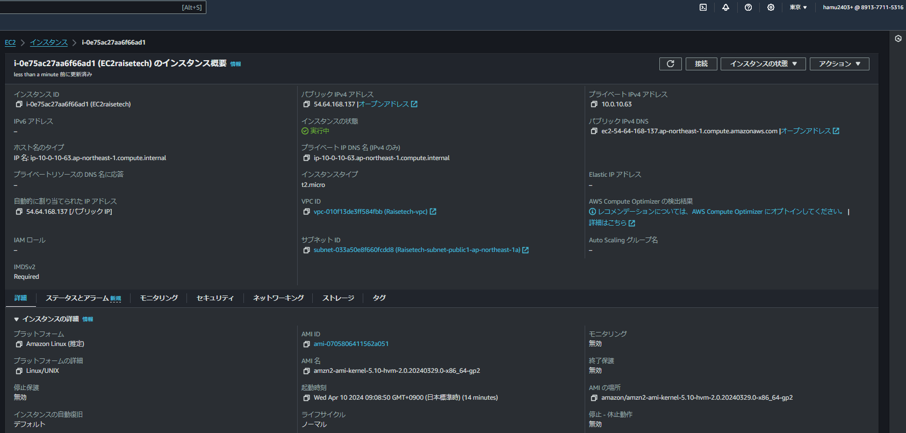

# 第4回課題

## VPC・サブネットの構築

* VPC作成

* サブネット **private1**

* サブネット **private2**

* サブネット **public1**

* サブネット **public2**

## EC2インスタンスの作成

## RDSの作成

## Teratermを用いたEC2へのSSH接続及びECからRDSへ接続

## 感想

* 秘密鍵の取り扱いには気を付けること、絶対に外部に流出刺せないことを心がける。
* また費用をできるだけ抑えるために、サインアウトの際は必ずEC2を停止する。
* 回を重ねるたびに知らない用語が増えていくので身につくように、また説明できるように勉強します。